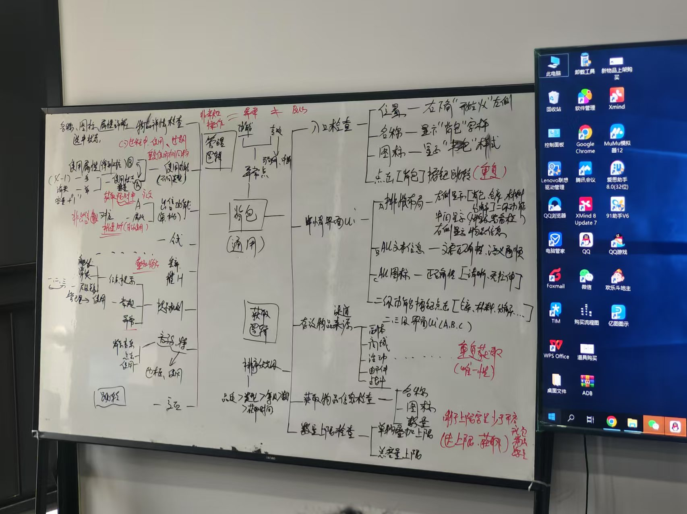
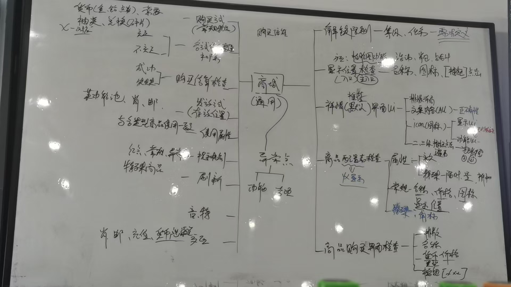
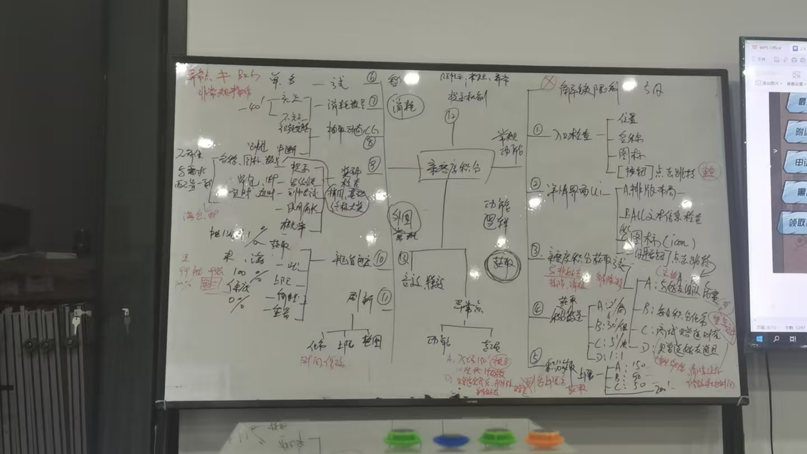
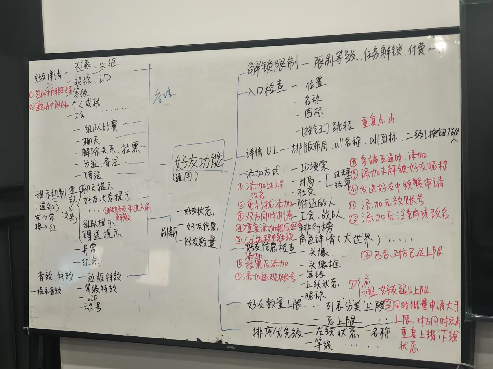
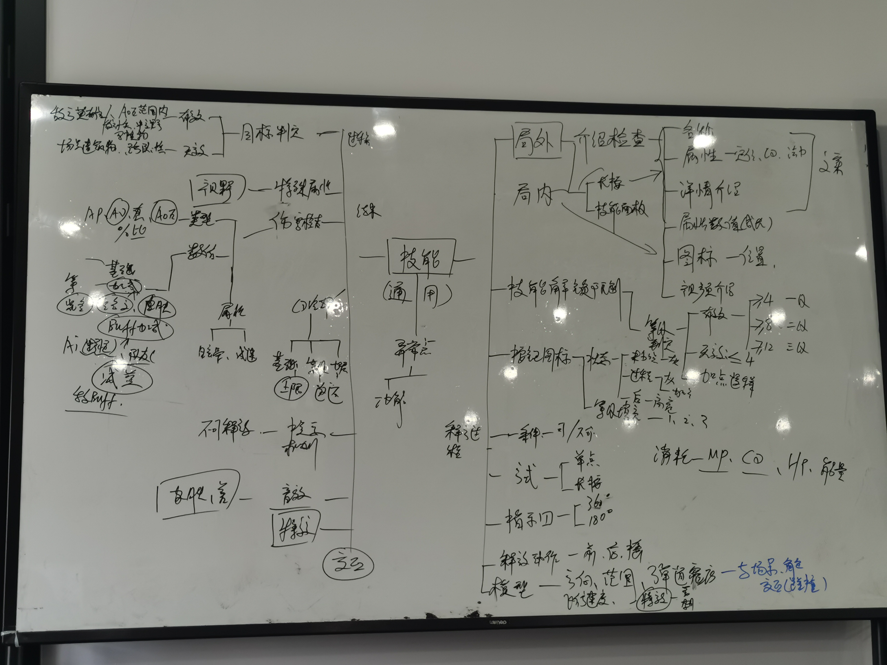
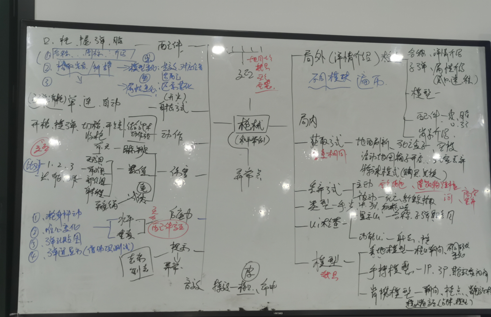
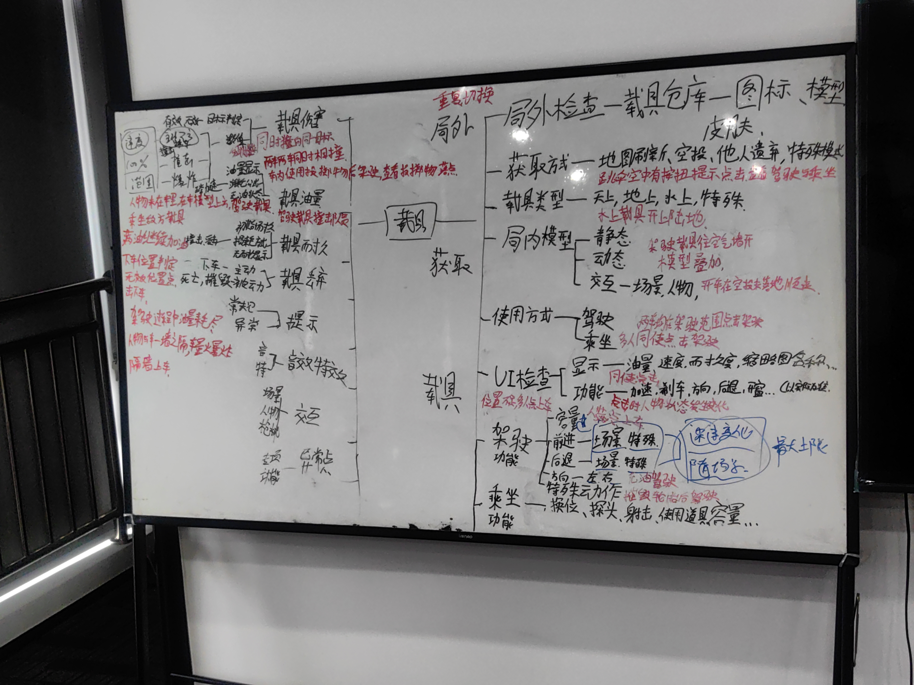
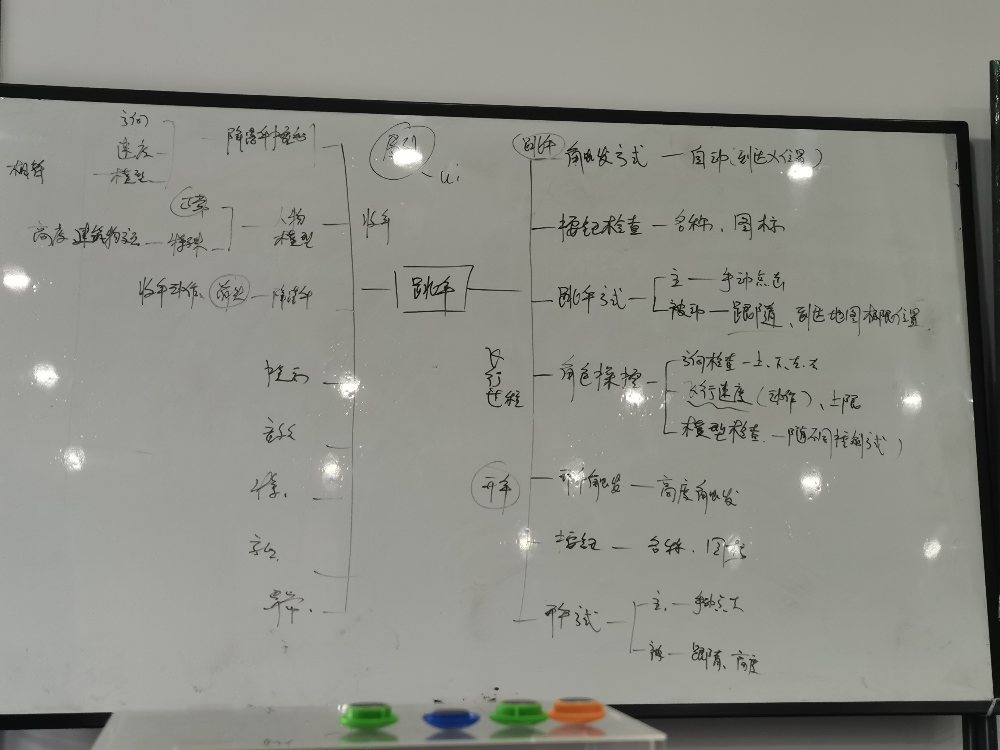
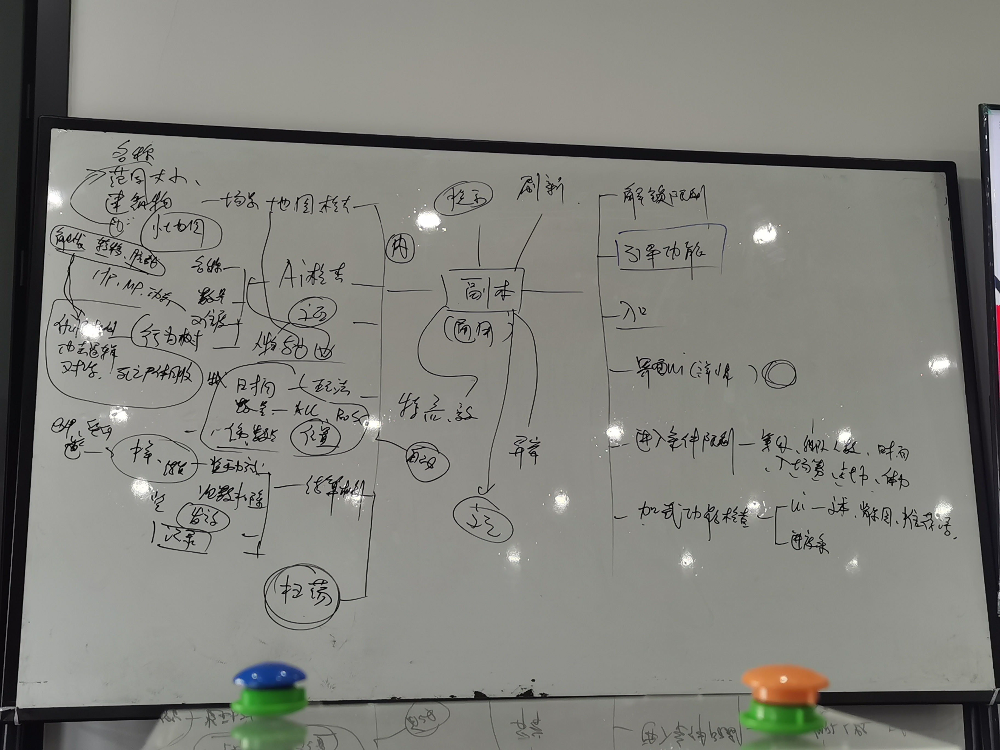
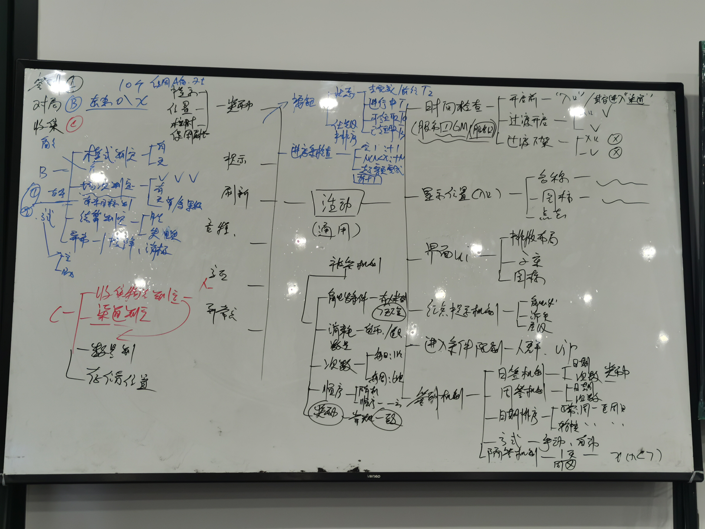

> [!IMPORTANT]
>
> 1.一切未知的地方都存在风险                             2.一切和需求不符合的都是BUG                      3.破坏性测试思维

# 安全

## 一、信息安全

1. 信息（账号、项目资料、验证）不能外传。
2. 不能携带（存储设备、私人电脑、设备）
3. 不允许拍照
4. 不允许透露薪资架构（保密协议）
5. 腾讯福利不允许变现：
    - 测试账号（Q币、Q点）点券
    - 腾讯发给你的私人账号货币福利变现
    - 不能在外网服务器暴露自己是测试人员

## 二、黑产

### 1、木马

开发-》分销-》挂马出信-》洗信出马

钓鱼链接

捆绑木马软件

APK（安卓），IPA（平果），（Windows）EXE

### 2、开挂

开发外挂、修改（数据）

1. 截获客户端发给服务器得数据包，修改后发送
2. 截获服务端发给客户端得数据包，修改后发送
3. 修改客户端内存
4. 服务器数据（黑客攻击 ）
5. 修改客户端配置文件

网络封包挂:实用工具，修改或模拟服务器端或客户端发出的数据包来实现的外挂

客户端挂，目标是游戏客户端（包括客户端得操作系统），一般通过增删改的方式实现，工具有调试工具（ollydbg）,反编译工具（IDA） 内存查看工具（cheatEngine）。需要对游戏引擎，游戏逻辑，操作系统有所了解。

内存挂：修改客户端运行时内存的外挂

客户端挂：修改客户端的配置文件的外挂

> [!IMPORTANT]
>
> 常见的游戏引擎有：
>
> 主流中很常用的游戏引擎分别为，ue4，unity，起源，cocos，jaya，egret，在国内其中unity、ue4占比最多，其次是cocos，再者是laya和egret。
>
> 游戏引擎与使用的语言：
>
>

> [!IMPORTANT]
>
> 游戏渲染？？？？

### 3、代练

影响游戏平衡和玩家体验

### 4、演员

影响游戏平衡和玩家体验

## 三、违规信息安全

涉黄（模型，外观，动作，语言，文字，图片），暴力（血腥，动作，文字），涉政（党政军），欺诈，赌博，宗教，敏感词（脏话）

# 游戏评测

## 游戏美术

## 系统相关

## 体验相关

> [!NOTE]
>
> 问：**当后面一个部分和前面的有交集的时候是否需要全部重新测试**？
>
> 回答：不需要，沟通后备注由谁来测试

# 游戏测试

## 1、定义：

- 2个保证：保证正常运行（安装、解析、运行、卸载）和保证版本质量（功能可用、弱网质量、兼容性质量、中断质量 、安全质量）
- 2个建议：保证易用性（提示和引导）和可玩性（探索性，内容和美术）

## 2、游戏测试的理解：

1. 游戏是一种特殊的软件，游戏测试的一部分内容和软件测试相同，但又有自己的特殊性。
2. 游戏测试的一部分内容和软件测试相同，但又有自己的特殊性。游戏需要软件工程知识，也需要专业的游戏测试（可玩性，美术效果，策划合理性）
3. 游戏测试要求测试人员具备极大耐心、恒心、细心，因为一些bug会让游戏出现致命影响）

## 3、测试组成

### 1、 传统软件测试

1. 测试目的:发现软件中的缺陷
2. 测试依据：需求/产品规格说明书
3. 每一种测试都需要产品运行在真实（正式服、白名单账号）或是模拟（测试服）环境之下
4. 每一种测试都要求以系统方法展示产品功能（测试点、测试用例），执行记录证明测试结果是否有效（用例执行记录），提交发现其中出错的原因（Bug单）让程序人员进行改造。

### 2、游戏本身的测试

#### 	a、游戏测试的特性

1. 游戏情节的测试：游戏任务系统的组成，即游戏的事件驱动
2. 游戏平衡的测试：经济平衡，能力平衡（包括技能、属性、种族、装备、经济系统等），保证游戏世界竞争公平性
3. 游戏文化的测试（不一定）：游戏风格是中国主导还是日韩风主导（从NPC设定到游戏整体世界观）。

#### 	b、游戏的可玩性测试

游戏世界的搭建，保证游戏的可玩性。

## 4、游戏测试和软件测试的区别

## 5、测试工具

> [!NOTE]
>
> 角色三C是什么？
>
> 答：在游戏设计和开发中，“角色三C”通常指的是以下三种主要角色：
>
> 1. **C（Character，角色）**：指的是游戏中的人物角色。这个角色可以是玩家控制的主角，也可以是游戏世界中的非玩家角色（NPC）。角色的设计通常涉及其背景故事、个性特征、能力、外观以及在游戏中的作用。好的角色设计能增加玩家的代入感和游戏的沉浸感。
> 2. **C（Camera，镜头）**：指的是游戏中的视角或镜头系统。镜头是玩家与游戏世界互动的窗口，设计良好的镜头可以提升游戏的可玩性和视觉体验。例如，镜头的运动、视角的变化、以及与角色的同步性都非常重要，能影响玩家的游戏体验。
> 3. **C（Control，控制）**：指的是玩家与游戏的互动方式，即控制系统。控制系统设计需要保证玩家操作的流畅性和准确性。无论是通过键盘、鼠标、手柄、触屏，控制系统都需要易于上手并能够支持游戏的玩法需求。
>
> 这三个“C”概念常常在游戏设计过程中相互交织，影响着游戏的整体体验：
>
> - **角色（Character）**决定了玩家的代入感和情感联系。
> - **镜头（Camera）**影响了玩家的视觉体验和对环境的感知。
> - **控制（Control）**则是游戏操作的核心，确保玩家能顺利地与游戏世界互动。
>
> 设计团队通常会平衡这三方面，以确保游戏既有深度又能提供良好的用户体验。如果你在做游戏设计或者相关的开发，理解并优化这三个方面是提升游戏质量的重要步骤。

## 6、玩家的期望

1. 对操作的希望：一致性
2. 对目标的期望：明确的指导
3. 对界面的希望：体贴、友好
4. 对感觉的希望，沉浸
5. 对规则的期望：逻辑

> [!IMPORTANT]
>
> 一切与需求不符的都是bug,比如标点符号、多音字（细心）

## 7、游戏的分类

端游、手游、页游、H5游戏

1. **角色扮演游戏（Role-Playing Game, RPG）**

**介绍**：玩家通过扮演角色，探索虚拟世界，完成任务并提升角色能力，通常伴随深度剧情和开放性玩法。

1. 端游：《巫师3：狂猎》《上古卷轴5：天际》《博德之门3》
2. 手游：《原神》《崩坏：星穹铁道》《放置奇兵》

------

2. **动作游戏（Action Game, ACT）**

**介绍**：以玩家的反应速度、操作能力为核心，包含战斗、跳跃和解谜等内容。

- 端游：《战神》系列《鬼泣5》《只狼：影逝二度》
- 手游：《影之刃3》《帕斯卡契约》《忍者必须死3》

------

3. **第一人称射击游戏（First-Person Shooter, FPS）**

**介绍**：玩家以第一人称视角体验射击和战斗，通常注重战术协作和精确射击。

- 端游：《使命召唤：现代战争》《CS:GO》《Apex英雄》
- 手游：《和平精英》《使命召唤手游》《穿越火线：枪战王者》

------

4. **即时战略游戏（Real-Time Strategy, RTS）**

**介绍**：玩家实时管理资源、建设基地、指挥军队，考验战略部署能力。

- 端游：《星际争霸2》《帝国时代4》《魔兽争霸3》
- 手游：《红警OL》《战争艺术：赤潮》《王国纪元》

------

5. **大型多人在线角色扮演游戏（Massively Multiplayer Online Role-Playing Game, MMORPG）**

**介绍**：玩家在一个大型共享世界中进行冒险，强调社交、任务和团队合作。

- 端游：《魔兽世界》《最终幻想14》《黑色沙漠》
- 手游：《天涯明月刀手游》《龙之谷2》《剑网3：指尖江湖》

------

6. **沙盒游戏（Sandbox Game, Sandbox）**

**介绍**：提供开放的世界，玩家可以自由探索、建造和创造，而不受任务限制。

- 端游：《我的世界》《方舟：生存进化》《泰拉瑞亚》
- 手游：《迷你世界》《创造与魔法》《ROBLOX》

------

7. **冒险游戏（Adventure Game, AVG）**

**介绍**：注重故事和世界探索，通常包含解谜和互动对话元素。

- 端游：《奇异人生》《古墓丽影》系列《塞尔达传说：旷野之息》
- 手游：《迷室》系列《未定事件簿》《暖雪》

------

8. **生存游戏（Survival Game）**

**介绍**：玩家需要在恶劣环境中收集资源、建造设施，并对抗敌人或环境威胁。

- 端游：《森林》《七日杀》《Rust》
- 手游：《明日之后》《辐射：避难所》《荒野行动》

------

9. **塔防游戏（Tower Defense, TD）**

**介绍**：玩家通过建造防御塔阻止敌人到达目标，注重策略性。

- 端游：《植物大战僵尸》《保卫萝卜》《王国保卫战》
- 手游：《植物大战僵尸2》《王国保卫战》手游版《Bloons TD6》

------

10. **解谜游戏（Puzzle Game）**

**介绍**：以逻辑思考、观察能力和创造性解谜为核心玩法。

- 端游：《纪念碑谷》《The Witness》《Portal 2》
- 手游：《纪念碑谷2》《糖果传奇》《脑洞大师》

------

11. **竞速游戏（Racing Game, RCG）**

**介绍**：玩家通过操控车辆进行比赛，注重速度和操控技巧。

- 端游：《极品飞车》系列《地平线：零之曙光》《尘埃》系列
- 手游：《QQ飞车手游》《狂野飙车9》《极限竞速：街头传奇》

------

12. **卡牌游戏（Card Game, CCG/TCG）**

**介绍**：玩家通过收集和使用卡牌进行战斗或解谜。

- 端游：《炉石传说》《昆特牌》《影之诗》
- 手游：《炉石传说》手游版《影之诗》手游版《三国杀移动版》

------

13. **格斗游戏（Fighting Game, FTG）**

**介绍**：玩家操控角色进行一对一或多对多的近身战斗。

- 端游：《街头霸王》系列《拳皇》系列《真人快打》系列
- 手游：《拳皇命运》《街霸：对决》《火影忍者：疾风传》

------

14. **模拟经营游戏（Simulation Game, SIM）**

**介绍**：玩家管理某种系统（如城市、农场或人生），强调规划与资源管理。

- 端游：《模拟人生》系列《文明6》《城市：天际线》
- 手游：《梦幻花园》《模拟城市：我是市长》《部落冲突》

------

15. **音乐节奏游戏（Music/Rhythm Game）**

**介绍**：玩家通过按键或触摸与音乐节奏互动。

- 端游：《DJMAX RESPECT》《节奏地牢》《OSU!》
- 手游：《节奏大师》《Cytus II》《古树旋律（Deemo）》

# 测试流程

## 测试类型

功能 冒烟 随机 黑盒 全量 白盒 灰盒 回归 验收 探索 压力 性能 兼容性 边界条件 逆向负载 稳定性 接口 自动化 UI测试 安全 本地化 单元 集成 系统 验收 扩展性

## 测试职责

1. 功能测试:：保证游戏各功能运行正常，与需求一致
2. 可玩性
3. 尽早介入**（尽早熟悉项目进度）**，尽快完成**（熟悉项目内容，完成产物产出，发现BUG，推进BUG修复）**，持续不断**（测试过程反复不断）**
4. 玩家立场评测

## 开发流程

市场=》策划=》开发=》运营=》市场

## 测试流程

1. 开始
2. 需求分析
3. 需求评审
4. 测试计划制定
5. 提取测试点
6. 编写测试用例
7. 用例评审
8. 测试前准备
9. 冒烟测试
10. 执行测试用例
11. BUG提交
12. BUG跟踪
13. BUG回归
14. 最终包全量测试
15. 编写测试总结
16. 汇报测试报告
17. 结束

## 新版本测试执行策略

完整=》随机=》回归=》发布=》冒烟=》完整

## 游戏生明周期

1. 立项
2. 首版
3. 技术封测（内部测试或研发测试）
4. 删档内测（ACC 数据）
5. 不删档内测（保留账号/密码）
6. .公测 ->（不开放充值商业化功能，保留数据）
7. 正式上线（申请版号 ，19 年新政策）
8. 产品下线
# 需求分析

## 需求分析-评审

- **分析**：验证需求正确性、完整性、无二义性
- **评审**：沟通、质疑和确认需求内容，以及开发人员确认需求是否可以开发，测试人员确认开发的实现方式
- **人员**：策划、开发、测试
- **产出**：新版本需求文档

## 需求分析的范围

1. 需求背景、目标、影响范围（交互模块）
2. 提示方式，异常处理方式
3. 主流程、操作流程和步骤说明是否合理
4. 需求上下文的一致性，是否与其他需求发生冲突（**例如是否有死锁的情况**）
5. 需求的逻辑是否足够清晰，每个条款是否都包含描述问题和解决问题
6. 挖掘隐形需求和相互依赖的需求（**前置条件是否有清晰的说明**）

## 需求分析的目的

熟悉需求内容（主干、分支、异常），把不明确、疑问、隐形需求在本地记录下来

## 需求分析方法

### 一、全局观考虑

1. 了解需求主要目的，了解功能业务流程，硬件环境，软件环境，交互模块等
2. 分析需求中的疑问及问题，包括但不限于时间限制、奖励方式、步骤顺序、用户操作场景
3. 列出需求中不合理、不合逻辑、不能实施、存在歧义或含义不明确的语句
4. 挖掘隐藏需求（如活动次数、角色关系、系统与系统之间的关系）

### 二、业务流程分析

1. 画流程，检查流程图合理性、准确性等问题
2. 检查分支流程、用户权限说明、规则和边界值是否缺失
3. 检查是否存在异常分支、不确定范围
4. 流程图列出每个阶段测试点

### 三、补充测试点

1. 补充测试点，比如UI测试点，进入方式等
2. 探索式测试方法补充测试点
3. 对需求中的疑问和测试范围进行**再次确认**

### 需求分析方法（贯口）

- **疑问插批注**
- **数字找边界**
- **时间问刷新**
- **交易“重”到账**
- **任务画流程图**

# 测试计划制定

测试主管/组长分配组员任务，评估时间点

# 测试点

## 背包测试点

## 商城测试点

## 亲密度测试点

### 亲密度需求文档链接如下：

> **[需求原文链接](https://bob-mou.github.io/docs/Document/亲密度系统.docx)**              **[需求原文本地链接](./Document/亲密度系统.docx)**

## 好友测试点

## 技能测试点

## 枪械测试点

## 载具测试点

## 跳伞测试点

## 副本测试点

## 活动测试点

**火影应援需求文档链接如下**：

> **[需求原文链接](https://bob-mou.github.io/docs/Document/火影应援活动需求.docx)**          	**[需求原文本地链接](./Document/火影应援活动需求.docx)**

- [测试用例](./测试用例.md)
- [测试工具](./测试工具.md)
- [测试用例](./测试用例.md)
