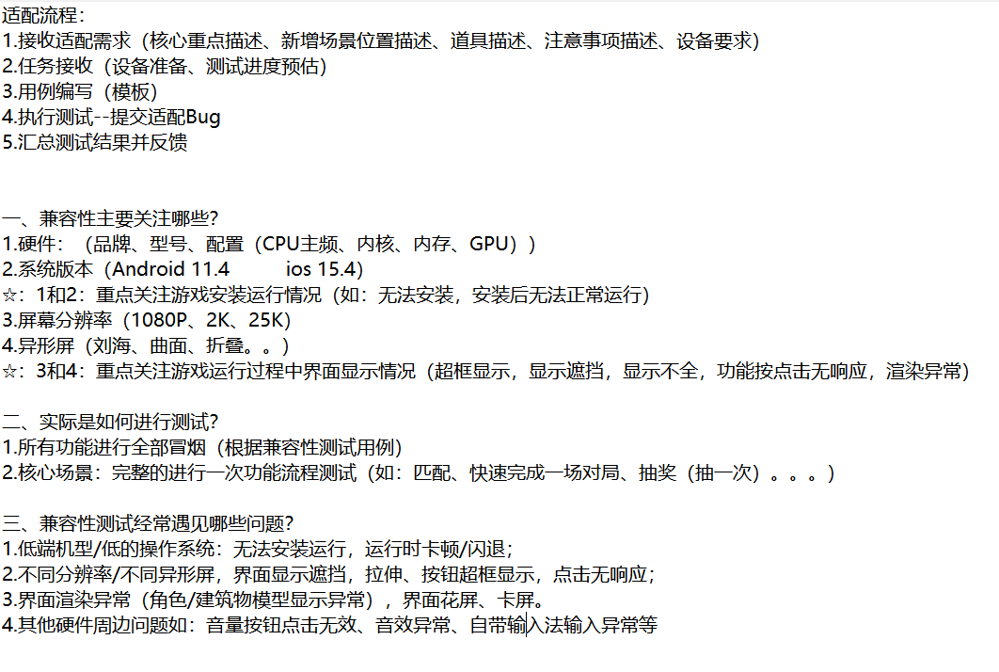
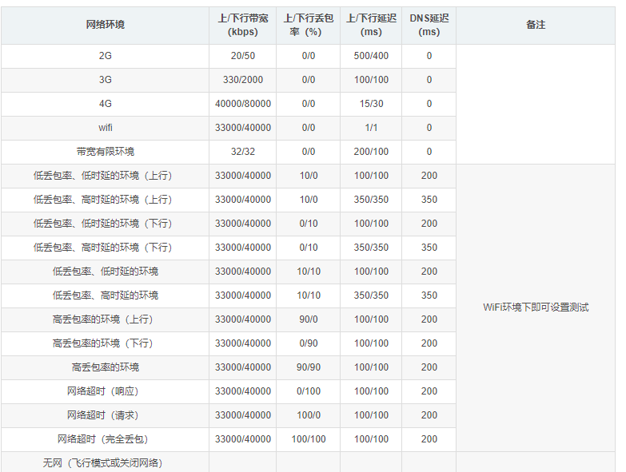

# 测试工具

## adb（记录测试结果）

常用命令

```
adb logcat --help 帮助
```

1.设备连接

确定硬件状态正常（包括Android设备处于正常开机状态，USB连接线和各种接口完好）。
Android设备的开发者选项和USB调试模式已经开启（在[设置]-[开发者选项]-[USB调试]打开USB调试）。
确认设备驱动状态正常（安装ADB驱动程序）。
通过USB线连接点好和设备后确认状态。
通过adb devices命令查看设备连接情况。

2.logcat抓取日志

```
adb logcat -v  time >D:ceshilog.log
adb logcat -v  time >E:logs\ceshilog.log
使用-v选项设置日志的输出格式。例如，adb logcat -v time会以时间格式显示日志。
```

3.shell 命令

```
adb shell 进入shell模式
pm list package  //使用包管理器寻找包含fun的包
```

4.随机事件模拟

```
adb shell monkey -p fun.bantong.fish.c -v 100000 >D:随机测试.log
```

5.adb 安装软件

```
adb install  软件包地址
比如：
adb install E:\fun.bantong.fish.apk
```

## 过滤日志输出

日志消息的标记是一个简短的字符串，指示消息所源自的系统组件。例如，“View”表示视图系统。

优先级是以下字符值之一（按照从最低到最高优先级的顺序排列）：

- `V`：详细（最低优先级）
- `D`：调试
- `I`：信息
- `W`：警告
- `E`：错误
- `F`：严重错误
- `S`：静默（最高优先级，绝不会输出任何内容）

1. 按标签过滤

   使用`-s`选项指定要过滤的日志标签。例如，`adb logcat -s ActivityManager`只会打印TAG为ActivityManager的日志。

2. 按级别过滤使用`*:E`等形式的过滤器来指定日志级别。例如，`adb logcat *:E`只会打印级别为Error的日志。

3. 使用grep过滤

   可以通过管道将`adb logcat`的输出传递给`grep`命令进行正则表达式过滤。例如，`adb logcat | grep MyApp`只会输出包含“MyApp”字符串的日志行。

4. 按进程ID过滤

   使用`--pid=`选项指定要过滤的进程ID。例如，`adb logcat --pid=12345`只会打印进程号为12345的日志。

5. 日志级别来过滤日志输出

使用adb logcat命令时，可以通过指定日志级别来过滤日志输出。例如：

1. **打印所有级别的日志**（默认情况）：

   ```bash
   adb logcat
   ```

2. **打印级别为Verbose及以上的日志**：
   由于Verbose是默认级别，因此不需要特别指定。但可以通过指定其他级别来间接实现，例如只打印Error级别及以上的日志后再恢复为Verbose级别（通常不这么做，因为直接打印所有级别更常见）。

3. **打印级别为Debug及以上的日志**：
   实际上，adb logcat命令没有直接提供只打印Debug级别及以上的选项。但可以通过不指定级别（即默认打印所有级别）或使用更高级别的过滤器（如Error）后再结合其他方法（如grep）来间接筛选Debug级别的日志。不过，通常开发者会关心特定标签的Debug日志，因此更常用的是按标签和级别组合过滤。

4. **打印级别为Info及以上的日志**：
   同样地，adb logcat命令没有直接提供只打印Info级别及以上的选项。但可以通过不指定级别或使用更高级别的过滤器来间接实现。

5. **打印级别为Warn及以上的日志**：

   ```bash
   adb logcat *:W
   ```

   这里的`*:W`表示所有标签（`*`）的日志级别为Warn（`W`）及以上。

6. **打印级别为Error及以上的日志**：

   ```bash
   adb logcat *:E
   ```

   这里的`*:E`表示所有标签的日志级别为Error（`E`）及以上。

7. **打印级别为Fatal/Assert的日志**：
   Fatal级别通常与程序崩溃相关，而Assert级别用于断言失败时。由于Fatal级别较为特殊且通常与程序崩溃紧密相关，因此在实际使用中可能更关注Error级别及以上的日志来间接包含Fatal级别的日志（因为Fatal级别在Error级别之上）。对于Assert级别，则可以通过指定特定标签和级别的组合来过滤。

**[ADB常用调试命令文档](https://bob-mou.github.io/docs/Document/Android调试常用命令.docx)**

## perfdog（性能测试）

性能测试，腾讯收费软件

## solox（性能测试）

性能测试，一个仿perfdog程序

python -m solox （默认）

## GM工具

常用GM命令（腾讯某游戏命令）

1. $clearmail
2. $clearbag
3. $kill
4. $item 153344  X
5. $openPvb
6. $dairlyTaskFinish

用途:便捷测试，修改对应游戏数据

方式：插件、游戏内按钮、网页、聊天框输入指令

入口：手势指令（和平精英）、大厅输入指令、游戏按钮

分类：前台GM  服务器GM

内容：前台GM:调试AI行为、获取物品、修改经验、等级、任务进度一键完成、战力修改

服务器GM：服务器修改时间、重启

道具表：道具ID、名称、图片获取地址、道具介绍、最低获取等级

配置表：

商品配置表：ID、商品名称、价格、货币、排序、位置、购买限制、货币种类、折扣、折扣时间、上架时间、下架时间、图标资源路径、是否允许索要、购买成功后是否可以立即穿戴、每日限购数量、每周限购数量

任务配置表：任务ID、名称、任务介绍、任务时间

活动配置表：活动ID 、活动时间、活动奖励介绍、活动介绍

# 概率测试：

1. 核对查看概率配置和游戏中的数据显示,目的：概率表与游戏显示是否一致（配置道具和道具概率）
2. 查看物品配置权重（道具：高、中、低品质），目的：核对道具权重和是否合理
3. 尝试多次测试，进行记录，查看结果（高概率可以测试出来，低概率不能测试出来）

概率测试常规方法：多次抽取，GM工具调试进行抽取，自动化工具测试抽取

低概率测试方式：更改配置表

1. 将低概率修改为高概率，0.0001%修改为100%，再改为20%，奖励表总概率为1
2. 恢复数值，继续多次验证结果，刷新

英雄技能测试注意点

英雄技能测试的时候，测试技能在时间非常充足的时候，技能尽可能的和其他全部英雄进行交互测试。在时间充足的时候，选取其中有代表性的英雄进行测试。

# 排序测试

品质：橙>紫蓝白灰

武器：武器，佩饰，防具，消耗

等级：高等级，低等级

时间：大类、武器、等级、时间

控制变量法测试：

1.测试品质：武器，等级，时间不变化，品质变化

# 伤害数值测试

1. 核对角色伤害配置（伤害成长公式），与实际的伤害显示数值对比是否一致   备注：不考虑任何加成表现
2. 实际的地图AI进行交互，查看AI头顶数据显示/血量扣除数值
3. 交互，与伤害加成功能进行交互，查看交互公式（装备穿戴，铭文穿戴，BuFF加成）（继续按：1.2步骤进行测试）
4. 验证更加精准的话，借助开发者工具（战斗日志）进行手机查看

# 测试服务器

01服务器，02测试服

01开发服务器、02开发服务器

策划服务器


# 弹道指示器

可以通过弹道指示器测试弹道分布，弹道下坠轨迹，弹道后坐力


新手引导时候，获取奖励时强制退出游戏可以重新进入新手引导并获得新手奖励

从而实现无限刷取奖励


好友上限BUG

好友上限300，黑名单上限300。299好友当好友拉黑后，加新的好友后恢复好友，好友数为301。


任务系统

主线任务挑战某一个任务，任务需求20-30级别，但是玩家通过其他方式达到了31级别

任务提前完成了后面一个等级阶段的任务，并且可以直接领取，没有设置领取限制，必须先完成前面一个阶段才能完成后面一个任务的内容


# 测试总结与报告

项目名称《》

版本号：

测试类型：

一、测试环境概述：硬件、系统、时间、人员

二、BUG 概述：XXX 版本新增 XXX 个，致命 XXX 个，严重，一般，轻微

三、测试模板：XXX\XXX

四、测试结果（插入用例执行结束）

发布标准

# 专项测试

> [!NOTE]
>
> 问：专项测试是在什么时候进行测试的？
>
> 回答：专项测试是在功能测试结束

> [!IMPORTANT]
>
> 问：冒烟测试是在什么时候进行测试的？
>
> 回答：冒烟测试是在每次获得新的安装包的时候，都需要进行冒烟测试

## 专项测试类型

中断、兼容性、性能、弱网、安全等

## 1、中断：

### 定义：

测试程序在遭遇意外中断时的响应能力与稳定性

### 常见的中断：

常见中断：媒体（音乐）、提醒（iOS）、锁屏解锁、照相按钮、短信、来电、通话挂断、手机语音、数据线插拔、充电、WIFI连接提醒、蓝牙提醒、低电量运行、闹钟等

网络终端：2G、3G、4G、5G、飞行模式、丢包、DNS高延迟、网络高抖动、误码

暴力测试：拔电池、杀进程、关机、重启、长时间使用、存储卡插拔、软件搬家（存储转移）、前后台切换

## 2、兼容性：



定义：兼容性测试是指对所设计的软件的在软件与硬件、软件之间的兼容性的测试，兼容性测试是指软件测试在特定的硬件平台上、不同的应用程序之间、不同的操作系统上不同网络环境等情况下能够很友好的运行测试。

硬件、操作系统、屏幕、分辨率

### 测试方法：

web测试和app测试

1. 全手工人工测试
2. 第三方家兼容性工具测试

优缺点：全人工测试，工作量大，覆盖不全；第三方兼容性工具测试，工作量小，主功能和主流程测试没有侧重点。两者结合才是最好的测试方法。

### 测试流程：

1. 接取需求任务：注意事项，测试内容说明，测试重点说明，测试设备要求说明
2. 获取测试资源文档：适配测试用例，Top设备列表，GM工具获取，测试包获取
3. 执行适配测试并提交适配问题
4. 提交测试结果和测试问题，汇总给组长

### 适配性测试时间点：

1. 游戏已封包且功能完善，即可进行适配测试
2. 新增功能，设计界面比较多（大版本更新）

> [!WARNING]
>
> 问：GPU是如何渲染游戏的？？
>
> 回答：

### 适配性测试需求：

各个功能重点关注点：

昵称使用最长昵称，

萌新账号过新手任务

第一人称

战斗场景

表情包系统

新增信号枪，gm指令添加106007进行测试

### 兼容性BUG:

1. GPU渲染机制
2. 文字和UI重叠、遮挡、出框
3. 闪退

## 3、弱网:

### 定义和目的

定义：通过弱网工具设置不同的网络损伤，模拟实际用户场景下的不同流量以及丢包率的损伤模型。

目的：确保游戏在弱网或无网环境下的正常运行，避免卡死、闪退、崩溃现象，确保弱网提示机制的正常触发，局外的常规提示网络差、加载中，图标信号提示触发，局内的断线重连机制触发提示，恢复后数据的同步性、正确性、唯一性

### 弱网的提示机制的触发：

局外：常规提示，网络差，记载中；图标提示：信号质量（绿色、橙色、红色）

局内:断线重连，（同步性、正确性、唯一性）

### 重连后数据

同步性、唯一性、正确性

### 延迟和延时

- 延时：(客户端->服务器)一个端点到另一个端点所需时间
- 延迟：一个端点到另一个端点的往返时间（不包含客户端、服务器的处理时间）

### 弱网测试流程

1. 确定需求（弱网参数模型，测试场景）
2. 测试前准备(工具的安装、弱网参数的设定)
3. 测试进行，根据编写的测试用例，模拟弱网网络环境进行测试，记录测试结果
4. 测试完成，整理报告上报组长

**弱网节点**：某一个功能完成（未完成 100%)时测弱网

### 几种弱网环境参数



#### 2G弱网环境：

1. 上下行延迟：500/400
2. 上下行带宽：20/50

#### 3G弱网环境：

1. 上下行延迟：100/100
2. 上下行带宽：330/2000

#### 3G网络高延时高抖动：

1. 上下行延时：333

2. 上下行抖动：900

3. 上下丢包率：8

4. 最大带宽：上：330kbps 下：2000kbps

#### 上行丢包：

1. 上行丢包80%

2. 上下行带宽：3400/4000

#### 下行丢包：

1. 下行丢包80%
2. 上下行带宽：3400/4000

#### 长时间断网状态：

1. 下行丢包100%

2. 上下行带宽：0

### 不同延迟的网络状态

如何定义网络延迟程度：（一般网络延迟[PING值](https://zhida.zhihu.com/search?content_id=627221255&content_type=Answer&match_order=1&q=PING值&zhida_source=entity)越低速度越快，但是速度与延迟没有必然联系）

1~30ms: 极快，几乎察觉不出有延迟，玩任何游戏速度都特别顺畅

31~50ms: 良好，可以正常游戏，没有明显的延迟情况

51~100ms: 普通， 对抗类游戏在一定水平以上能感觉出延迟，偶尔感觉到停顿

100ms~200ms: 较差，无法正常游玩对抗类游戏，有明显卡顿， 偶尔出现丢包和掉线现象

200ms~500ms：很差，访问网页有明显的延迟和卡顿，经常出现丢包或无法访问

\>500ms：极差，难以接受的延迟和丢包，甚至无法访问网页

\>1000ms：基本无法访问。

### 常见的弱网场景和解决方案

1.现象：应用数据下载中，因网速过慢点击取消并重新登录，数据初始化完成后出现重复 ，造成数据不一致。

原因：数据下载过程中，下载失败后，未进行数据回滚，中止后重新下载，出现数据重复

解决:使用事务处理数据下载，在下载失败后，本地数据进行数据回滚

2.现象：数据上传过程中，由于网络延迟或者网站阻塞的原因，触发重传机制或二次点击上传按钮，导致出现数据重复写入，形成脏数据

原因：数据上传中，由于失败重传机制，会出现连续两次写操作，并没作唯一性识别

解决:利用数据特性，对可能造成脏数据的地方，使用关键字段利用hash表作唯一性识别。

3.现象：弱网环境下的，用户输入用户账号和密码进行登录，应用连接超时时，返回用户名和密码错误提示

原因：弱网环境下的连接超时后，按照强业务逻辑处理，导致返回超时异常

解决:弱网连接超时后，提示连接超时

4.现象：弱网环境下，用户第一次输入后，并再次输入全新关键字并发送请求，等待结果过程中，当前的搜索结果被之前的搜索结果覆盖

原因：中间返回的数据比较慢，最终显示的时候之前的请求返回的数据覆盖了现有数据

解决:异步请求的未完成的数据不做处理

## 4、性能：

### 定义和目的

定义:通过自动化工具（perfdog）模拟多种正常、峰值、异常负载条件下（高中低端手机）对系统的各项指标（CPU、内存、温度、流量、FPS）的测试。

目的:验证系统是否符合性能要求，提出系统优化建议，保证系统运行流畅、功耗符合预期

### 性能测试分类

1. 客户端性能
2. 服务器性能

### 性能测试流程(专职):

1. 接受性能需求（设备要求（设备基线）、性能指标/标准（内存消耗、cpu占用、网络延时、加载时间）、测试场景）
2. 设计性能场景用例
3. 搭建测试环境
4. 执行性能测试并收集数据
5. 汇总并提交数据对应人员
6. 分析数据，给出调优建议

### 性能测试流程(辅助):

1. 接受性能测试用例
2. 搭建测试环境
3. 执行性能测试并收集数据
4. 汇总并提交数据给组长

### 性能需求：

1. 硬件设备要求（安卓 IOS 低中高端机）
2. 测试场景(游戏加载场景、挂机场景、模块切换场景、对局并发场景（PVP  PVE）)
3. 性能指标
4. CPU占用
5. 内存消耗
6. FPS（高中低端游戏推荐配置的运行比如中端机:限制60帧不低于50FPS,限制30帧不低于25FPS）
7. 流量（单位时间消耗流量）
8. 温度（整机温度）

FPS无明显跳帧，无明显卡顿，响应无明显延迟，反复切换游戏场景、滑动页面，内存无明显增长，游戏测试不运行其他应用

### 测试注意事项

测试之前保证测试环境一致、数据一致

1. 手机电量充足、手机起始温度（小于35度(参考perfdog电池温度)）、锁定手机亮度
2. perfdog 勾选所有可选项，保证数据完整性
3. 开启测试之前，确保手机没有无关的APP进程
4. 每个关卡需要使用单独的标签区分开

### 测试用例：

1. 模块
2. 测试场景
3. 操作步骤
4. 测试时长
5. 测试目的

### 性能测试用例


| 测试场景   | 操作步骤                    | 测试时长 | 测试目的                                                     |
| :--------- | --------------------------- | -------- | ------------------------------------------------------------ |
| 挂机       | 进入游戏界面 ，不做任何操作 | 600s     | 保证游戏不做任何操作时，所有指标的数据平稳性，无异常数据表现 |
| 场景切换   | 点击不同场景的按钮          | 120s     | 反复加载游戏资源，关闭资源，查看内存是否有积压导致内存泄露   |
| 高负载场景 | PVE 或PVP进行高负载游戏对战 | 多次对局 | 游戏高并发场景的数据指标                                     |

### 2024年低中高端机型举例

1. 高端机：iQOO Neo8 高通晓龙 8+
2. 终端机：HUAWEI Mate 30 华为海思990
3. 低端机：小米 12  高通 骁龙778G

硬件设备（高端机型：苹果iPhone 15 Pro系列，华为Mate 60 Pro；中端机型：红米K60，OPPO Reno9；低端机型：红米Note 12），测试场景()，性能指标关注：1.CPU 2.内存消耗  3.FPS,4.流量，5.温度（整机温度≤37摄氏度）

### 性能需求分析

1. 定位需求类型，游戏大厅和直播类、活动类型、局外页签类、loading类型、对局类、道具类

2. 游戏大厅和直播类：这类注重挂机一段时间后查看内存、温度、帧数，根据底层架构不同，帧数不同，可能挂机状态下帧率有规律性波动，只要视觉和体感没有卡顿问题不大

3. 活动类型：注重活动页签切换和重复打开内存增长问题

4. 局外页签类：和活动类差不多，多注重重复打开和所有页签切换后的内存变化

5. loading类型：重复尝试加载取平均值

6. 对局类：这类需求比较重要，是客户端性能测试的核心，无论是帧数、卡顿、帧延迟、内存、CPU、GPU、温度、全部都需要重点注意

7. 道具类：枪械、皮肤、角色、注重第一第三视角使用时的性能数据，然后对比同类型的数据。

### 性能测试问题Q&A

1.性能测试流程?性能工具用的是?收费吗?

回答：流程：

- 接受性能测试用例
- 搭建测试环境
- 执行性能测试并收集数据
- 汇总并提交数据给组长

性能工具是perfdo;软件收费

2.性能测试指标关注哪些，标准是多少?

​	fps，cpu占用，Gpu占用，内存占用

3.fps是什么?fps单位是什么?fps没有答到相应的值要怎么判断，影响它的因素?

​	每秒钟游戏的画面数量，单位是：帧；使用工具查看对应的值；影响因素有：fps，cpu占用，Gpu占用，内存占用，温度，网络

4.突然的掉帧原因?

​	cpu占用过高，Gpu占用过高，内存占用过高，温度过高，网络延迟，游戏系统BUG等问题

5.jank和掉帧的关系两者必然影响吗?

​	jank代表卡顿，（单词原来的意思是：不稳定，卡顿），关系是掉帧不一定卡顿，但是卡顿一定掉帧

6.内存泄露要怎么判断?内存的定义?

​	判断是：内存持续升高，定义：ROM和RAM，RAM：随机访问存储器 (Random Access Memory，易失性。ROM：只读存储器 (Read Only Memory)，非易失性。

7.帧耗时是什么?单位是什么?用来干嘛?帧耗时与帧率是什么关系?

​	帧耗时（Frame Time）是帧耗时指生成单帧图像所需的时间，从开始渲染到完全输出所消耗的时间总量。单位一般ms(毫秒)

8.测试性能是发现过哪些性能问题?什么原因导致的?

1. 使用枪皮肤释放技能掉帧=》原因是：资源加载导致内存
2. 击杀掉帧=》原因是：资源加载导致内存
3. 跳转页面卡顿=》原因是：资源加载导致内存
4. 游戏玩久了内存占用上升=》原因是：内存泄露

性能测试报告组长编写，我有看过。
包括版本号、测试时间、测试服、风险等级、测试类型、测试平台、测试结论

测试阶段有多少个服务器？
测试服（自命名test-01，备用test-02），cn性能，开发服，策划服，运营服，8001外网
性能bug:
安卓，击杀瞬间掉帧；10人比单人CPU上升10%；温度。

- [测试用例](./测试用例.md)
- [测试工具](./测试工具.md)
- [测试用例](./测试用例.md)
