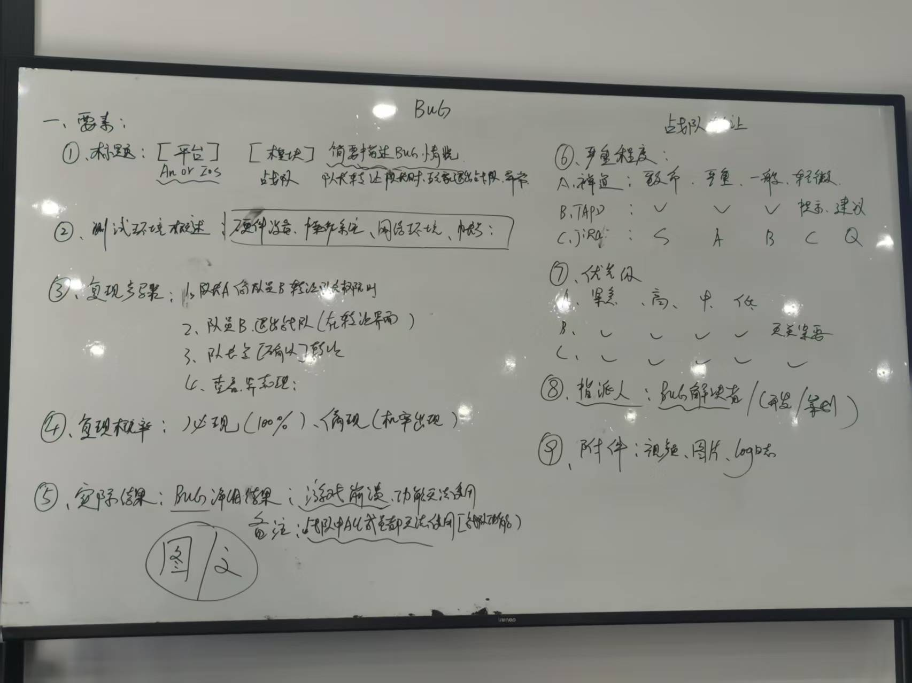
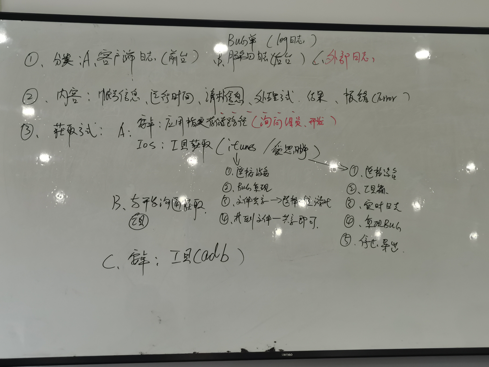
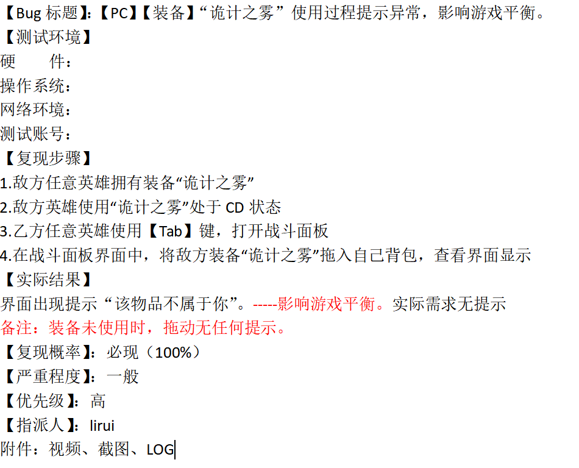
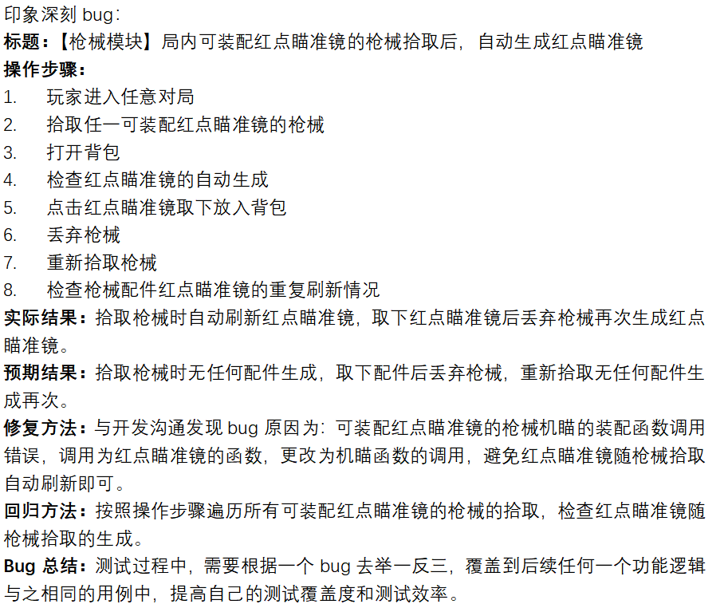
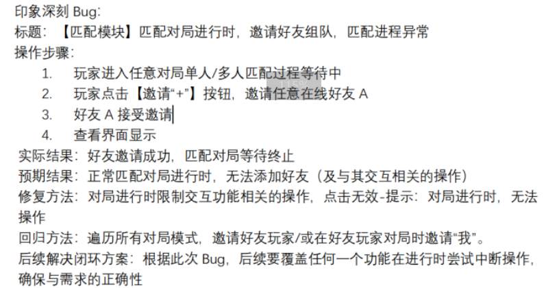
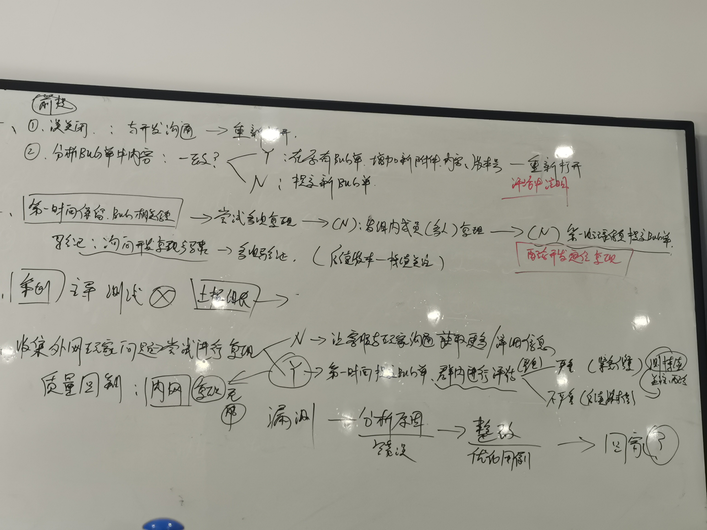

# 测试用例

## 概念

是为了测试目的（需求/功能）而编写的一组测试条件、测试输入、以及预期结果，已便测试程序路径的或核实是否满足某个特定需求

## 八大要素（TX七大要素）

1. 用例编号
2. 所属模块
3. 用例描述
4. 前提条件
5. 操作步骤
6. 预期结果
7. 备注
8. 优先级

## 用例的种类

1. 全功能测试：涵盖全部的测试对象的全部功能测试用例
2. 通用用例：不同模块的的通用功能的测试用例
3. 最小检查点：容易出BUG 的点
4. 冒烟用例：重点功能测试用例
5. 专项用例：性能、弱网、兼容

## 用例设计方法

### 一、等价类划分法

少量代表性测试数据，即可取得比较好的测试结果。等价划分分为有效等价和无效等价。有效等价类：对规格说明是合理的，有意义的输入数据构成的集合。

举例;

1.输入值判定，如，玩家昵称(要求 3-9 位中文），有效：中文、3-9 位，无效：其他类型文字、值<3

2.功能判定，如角色装备穿戴、攻击目标判定、释放范围判定、商品物品货币出售类型判定。

### 二、边界值划分法

对输入和输出的边界值进行测试的一种黑盒测试方法。

实例: X取值 $x \in \mathbb{(3,20)}$ ，测试用例6条,\{2,3,4,19,20,21}

### 三、错误推断法

基于经验和直觉推测程序可能出现的错误，通常是利用异常操作来推断错误

### 四、判定表法

判定表法分析和表达多逻辑条件线下的执行不同操作。

1. 条件桩(condition stub)
2. 动作桩(action  stub)
3. 条件项(condition Entry)
4. 动作项(action Entry)

### 五、场景设计法

通过使用“场景”对软件系统的功能点或业务流程进行描述的方法，包括**基本流和备选流**。常用UML用例设计方法。需要覆盖用例的主要成功场景和扩展场景，并且补充适当的正反卖弄测试用例和考虑异常的操作出现。

## 测试用例

### 实例：好友模块

## 用例评审

### 1.组内评审

测试组员编辑测试用例，其他组员提出问题和建议（评审时标记），修改优化后的测试用例输出大群（测试、开发、策划）查看。用例编写完成后，用例上传归档。

### 2.三方评审

测试组（所有人用例编写完成后）与开发策划协商时间点，测试主导会议，会议中提出问题和建议（评审时标记），修改优化后的测试用例输出大群（测试、开发、策划）查看。用例编写完成后，用例上传归档。

> [!IMPORTANT]
>
> **问题：用例一定要经过测试、开发的评审后才能执行吗？**
>
> **回答：实际情况不一定，但尽可能让组长等人知道你在执行**

# 测试前准备

测试账号：项目组提供，自己注册，账号是否需要添加白名单（项目组要求）

测试设备：功能测试，中高端机器，安卓，ios，鸿蒙,

测试网络：测试组专用WIFI，网络IP是否添加白名单

测试资源准备:SVN，沟通群下载，云盘下载

1.测试包获取，测试包版本核对-》安装

2.道具准备、配置表资源获取

3.GM工具获取

# 冒烟测试

1. 主功能冒烟：针对已经实现的功能进行验证，验证是否有入口且正确
2. 全量冒烟：针对已经实现的功能进行验证，验证功能入口，以及所有的分支和执行流程正确
3. 冒烟用例：提取全部功能的用例的5%，去执行。

# BUG表单

## 要素（以禅道为例）

1. 标题:[平台]（安卓 OR IOS）简要描述BUG的情况
2. 测试环境概述：硬件平台 操作系统 网络环境 账号
3. 复现步骤：1.   2.    3.   4.    5.
4. 复现概率：必现、偶现、
5. 实际现象：BUG结果、游戏崩溃
6. 严重程度：**致命、严重、一般、轻微**
7. 优先级：**紧急、高、中、低**
8. 指派人：BUG解决者（开发/策划）
9. 附件：视频、图标、Log日志

### 不同平台的严重程度分类：

1. A 禅道：致命、严重、一般、轻微
2. BTAPD:致命、严重、一般、提示、建议
3. CJIRA:S、A、B、C、Q

### 不同平台的优先级分类：

1. A 禅道：紧急、高、中、低
2. BTAPD:紧急、高、中、低、无关紧要
3. CJIRA:紧急、高、中、低、无关紧要

### BUG严重程度

1. 致命：闪退、卡死、崩溃、和软货币相关

2. 严重：功能无响应、功能错误、数据错误、违规信息

3. 一般：UI错误、音效

4. 轻微：语法错误、文字错误、建议相关

### 修复优先级：

1. 紧急：完全卡进度、立即修复
2. 高：卡部分进度、尽快修复
3. 中：不卡进度、本版本修复
4. 低：可不修复（本版本）

# BUG执行

## 执行结果：

1. Pass:P(大写、加粗、绿色字体）-通过
2. Fail:F(大写、加粗、红色字体）-不通过
3. N/A（大写、加粗、黑色字体）-未实现

## Bug 状态流转（生命周期流转）

## 提交BUG单

## 印象深刻的BUG（口诉）

BUG技能命中野怪后（强控无伤害）没有触发仇恨机制

修复，控制技能加一点伤害

## BUG种类

1. 文字描述类BUG：标签页、标签页中的时间显示、文字描述、礼包详情等等
2. 实际和需求不一致的BUG：比如文字和文档不符合，奖励和文档不符合，奖励数量和需求不符合、图片、按钮显示位置和文档不符合等
3. UI类BUG：文字显示格式、图片、图片重叠、显示和内容不一致
4. 功能操作类BUG：功能阻碍、操作后和预期不符合、卡顿

## BUG问题相关

1.测试时发现一个已关闭的 Bug,后续版本测试时又复现了，该如何处理？

首先排查 bug 的关闭原因，若误关闭的话，与开发进行良好的沟通后重新打开 bug；如若正常关闭的话，分析 bug 单中内容是否与之前一致，一致的话就在原有的 bug 单增加新附件、内容、版本号后重新打开 bug,不一致的话就提交新的 bug 单。

2.如果发现一个偶现的 Bug，你会怎么处理？

第一时间保留 bug 相关信息，尝试多次复现，还是不能复现的话,发组内成员多人复现，还是不行的话，第一时间记录信息提交 bug 单并配合开发定位复现，验证时询问开发复现步骤，并多次验证，在后续版本中持续关注。3.你提交的 Bug，开发拒绝你的 Bug 单，你会怎么做？先查看，后沟通，测试主导，实在不行上报组长

4.如果你负责的版本内容，在版本发布后，收到外网玩家投诉，你会怎么做？

收到外网玩家问题后尝试进行复现，不能复现的话，让客服与玩家沟通获取更多详细信息，如果可以复现的话，第一时间提交 bug 单，群内进行评估；程度严重立即紧急修复，程度不严重后续版本修复，整个测试过程中要持续关注、配合；内网可以复现的话，就属于漏测，分析错误原因，整改优化用例，待定。

5.如果你发现你的同事测试的内容有 Bug，你会怎么做?

6.如果同事请假，你按照同事写的用例执行发现 Bug，你会怎么做？

- [测试用例](./测试用例.md)
- [测试工具](./测试工具.md)
- [测试用例](./测试用例.md)
